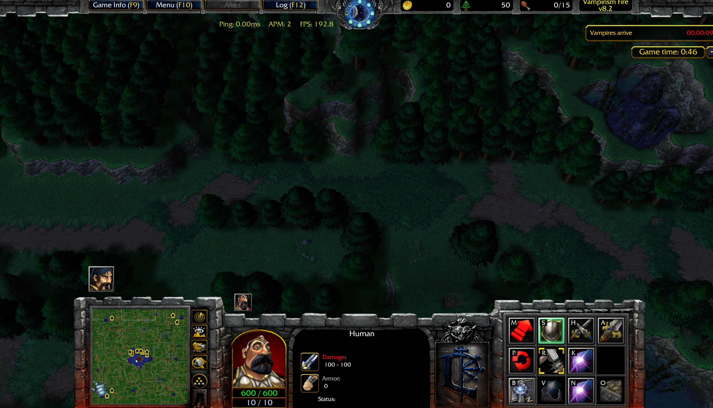
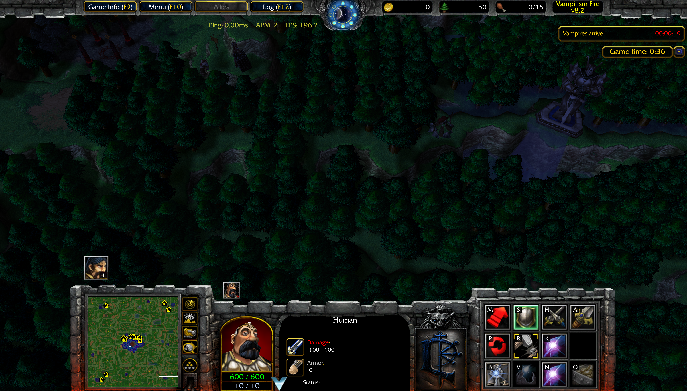
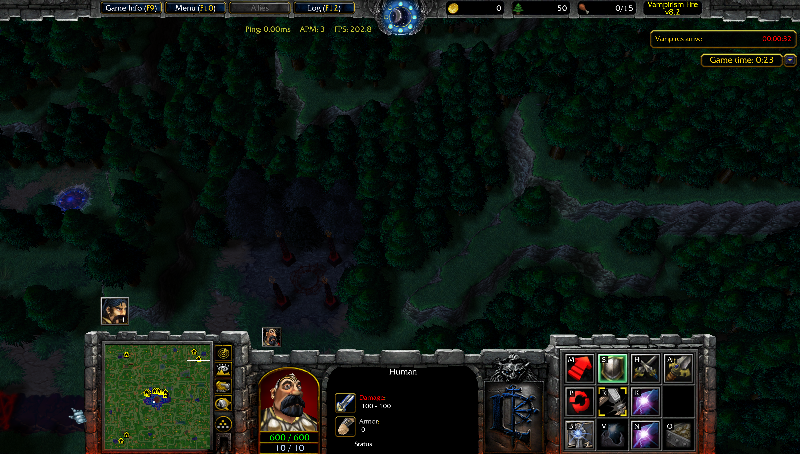

# Vampirism Fire 8.2.2

---

## Main

- Disabled tracker spawn if a slayer is in a claimed base.

---

## Custom Mode 

- New custom mode option **no edge bases**
  - All edges bases removed when the game start. 

### Solo Vamp Mode

- Updated income values : 
  - Minutes 12–17: **60** gold/minute
  - Minutes 18–23: **100** gold/minute
  - Minutes 24–35: **150** gold/minute
  - Minutes 1–11 and minute 36 onward remain unchanged.

- Chain cd 50% reduction removed
- When the vampire cast a chain, a second chain will be casted on a random furb within 500 range of the vampire.
---

## Human

---

## Orc

---

## Architect

- Re added [The-Casino]
  - Added ability tooltip **Casino Rules**
  - Added **Gambling Dice**
    - Requires 5 gold, 120 cd
    - 3/6 chance: Get 7 gold (earn 2 gold)
    - 2/6 chance: Nothing (you lose 5 gold)
    - 1/6 chance:
    - Tax Tower

- [Tax-Tower]
  - 1 attack speed, 600 NORMAL damage, 5000 hp. 
    - Can be upgraded 3 times requiring cita, cc, boo
      - Cita level 2: 10000 hp, 1800 dmg. Cost 15000w
      - Cc level 3: 15000 hp, 5400 dmg. Cost 40,000w
      - Boo level 4: 20000 hp, 0.5 attack speed, 15,000 damage, cost 100,000w

- [Jade-Wall] tooltip fixed.

- [Marble-Wall] re added
  - Passive ability :
    - For each armor within **500 range** of the wall, gain **+25 armor**. For each minion within **500 range** of the wall gain **+10 armor**.
    - Repair time **35**
    - Base armor **100**
    - Gold cost : **45g**
    - Lumber cost : **85 000**
    - Base hp : **28 000**
    
---

## Vampires

---
