# Vampirism Fire 8.3

---

## Main

- Disabled tracker spawn if a slayer is in a claimed base ally base.
- Builders no longer have permanent vision in the vampire base.
  - Before
  
    
  
  - After
  
    

- [Holy-Blood-Tower] can now be paused by flag.
- Fixed an issue that would allow observers to vote in the custom mode.
- [Big-Magic-Potion]
  - Gold cost reduced from **9 -> 5**
  - Lumber cost reduced from **22 000 -> 17 000**
- Fixed an issue that would allow observers to vote in the custom mode option.

- Harvesters now have sleep effect if they are not harvesting.

  

- [Race-Selection]
  - Changed the placements of the race buttons
  - Before :
  
    

  - After :
  
    

---

## Custom Mode 

- Added new vamp mode to the custom mode option instead of alternative to pro mode and custom mode.

- New custom mode option **no edge bases**
  - All edges bases removed when the game start. 

  
  
  

### Solo Vamp Mode

- Updated income values : 
  - Minutes 12–17: **60** gold/minute
  - Minutes 18–23: **100** gold/minute
  - Minutes 24–35: **150** gold/minute
  - Minutes 1–11 and minute 36 onward remain unchanged.

- Chain cd 50% reduction removed
- When the vampire cast a chain, a second chain will be casted on a random furb within 500 range of the vampire.
---

## Human

- Critters now correctly award mana to the **main-builder** when killed.
- [Black-Magic-Spire] reworked + fixed.
  - Removed the minions abilities
  - Purge ability should now correctly purge the banish ability.

- [Bouncy-Orb] (Fix)
  - Level 1 Now correclty require citadel of faith.
  - Level 2 now correctly require command center.
  - Level 2 gold cost was increased from **0 -> 10g**
- [Temple-of-Prayers]
  - Fixed all pacts rewards.
  - Fixed an issue that would not apply pact effect on wall.
  - Fixed an issue that would not destroy pact effect when a pact expire.
  - Fixed the UI that shows pacts duration for each player.

    

  - Hover :

    
---

## Orc

- Fixed an issue that would require 2 gold mines instead of 1 to upgrade **Fortress**
- Fixed an issue that would allow orcs to train 2 slayers.
- Fixed an issue that allowed Orcs to research Slayer Tech two extra times; it is now capped at level 3 like the other races.
- [Main-Builder] mana regeneration increased from **0.100 -> 0.200**
- Wall tower tint changed to orange :
    
    

---

## Architect

- [Main-Builder] mana regeneration increased from **0.100 -> 0.200**

- Re added [The-Casino]
  - Added ability tooltip **Casino Rules**
  - Added **Gambling Dice**
    - Requires 5 gold, 120 cd
    - 3/6 chance: Get 7 gold (earn 2 gold)
    - 2/6 chance: Nothing (you lose 5 gold)
    - 1/6 chance:
    - Tax Tower

- [Tax-Tower]
  - 1 attack speed, 600 NORMAL damage, 5000 hp. 
    - Can be upgraded 3 times requiring cita, cc, boo
      - Cita level 2: 10000 hp, 1800 dmg. Cost 15000w
      - Cc level 3: 15000 hp, 5400 dmg. Cost 40,000w
      - Boo level 4: 20000 hp, 0.5 attack speed, 15,000 damage, cost 100,000w

- [Metal-Amethyst-Wall]
  - Tint changed :

    

- [Bounty-Jade-Wall] 
  - tooltip fixed.
  - Tints changed to golden color :
  
    

- [Marble-Wall] re added
  - Passive ability :
    - For each armor within **500 range** of the wall, gain **+25 armor**. For each minion within **500 range** of the wall gain **+10 armor**.
    - Repair time **35**
    - Base armor **100**
    - Gold cost : **45g**
    - Lumber cost : **85 000**
    - Base hp : **28 000**
    
---

## Vampires

- [Altar-Of-Blood]
  - Now owned by both of the vampires.
  - Fixed the issue where Altar of Blood would require "nearby patron" to buy minions.
  - Fixed an issue that would provide visions in the middle of the map to the builders.
  - Can be selected from a button and binded like the research center.

  
  
- Reverted back the bounty gain from Awakening.

- Vampires can now use tp rod on frenchies.

- [Blood-Particle] Level 2
  - Cost increased from **7 -> 10 lumber**

- [Urn-Of-Reveal]
  - Duration increased from **10 -> 25 seconds**.
- [Unholy-Infernal]
  - Now unlock at the **min 16** mark.

- Removed the unintended **Vampire poison** upgrade from the **vampiric research center**

- Changed all hotkeys to buy items and upgrade for the vampires to fit grid hotkeys (qwerty).

- [Silent-Whisper]
  - CD increased from **45 -> 60** seconds
  - Mana cost increased from **600 -> 800**
  - Stock cooldown increased from **120 -> 240** seconds
 
  - When holding 2 *Silent Whisper* in vampire inventory slot, it combine to upgraded version : 
  - CD reduced from **60 -> 30** seconds
  - Mana cost reduced from **800 -> 0**

- [Dark-Spear]
  - Now regenerate **100 mana** for each unit killed
  - Now regenerate **400 mana** for each slayer kill instead of **100**

- [Nocturnes-Edge] item removed.

- Levels upgrades locked if the vampire is level *23* before min *15*.

- [Cloak-of-Power]
  Gold cost increased from **2400 -> 2600**
  Damage gain reduced from **12250 -> 10 000**

- [Awakening]
  Fixed an issue that would award more gold than intended.

- [Sphere-Of-Doom] now correctly display red screen when bought.

---

## Qol Changes 

- Updated multiple icons and tooltips for clarity and consistency:
  - Replaced the static Slayer Tech hero icon with icons that change through the upgrade levels.
  - Replaced the Vampire Necromancy Book icon with the Advanced Necromancy Book icon.
  - Renamed **Orc's Vault** to **Human's Vault** so requirements consistently refer to the same building name.
  - Updated the Small, Large, and Ultimate Claws of Attack icons and descriptions, including their combination guide.
  - Replaced the reused **Magic Plating** icon with a distinct shield icon.
  - Updated the Tower Defenses upgrade icons so levels 1 and 2 use a consistent visual theme.
  - Replaced the Single Healing Tower Vitality icon with a clearer healing-tower upgrade icon.
  - Expanded the Gold Plating tooltip with wall-color references.
  - Updated the Holy Essence icon and description to better communicate its tower-upgrade purpose.
  - Replaced the reused Engineer repair icon with an engineering icon.
  - Updated the Devotion Aura icon and level descriptions, including armor-stacking behavior.
  - Added a warning that Mana Resistance Shield research does not stack with the item.
  - Updated several Vampire Research Center upgrade icons, descriptions, and colors.

### Visual Comparison

| Before | After |
| :---: | :---: |
| 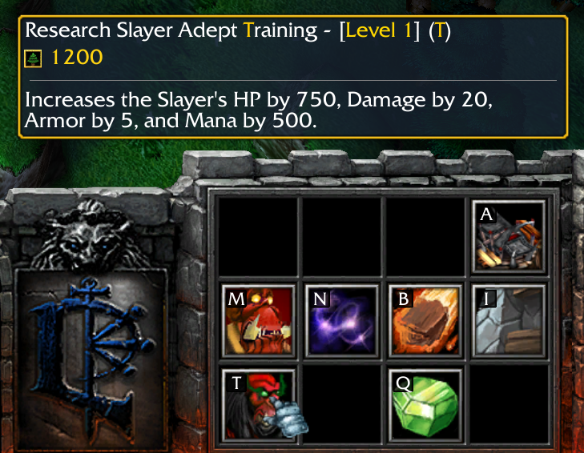 | 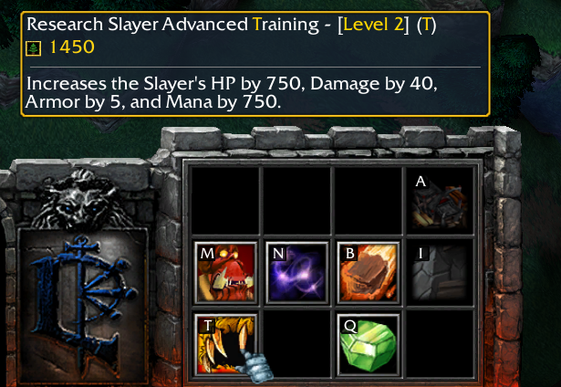 |
| 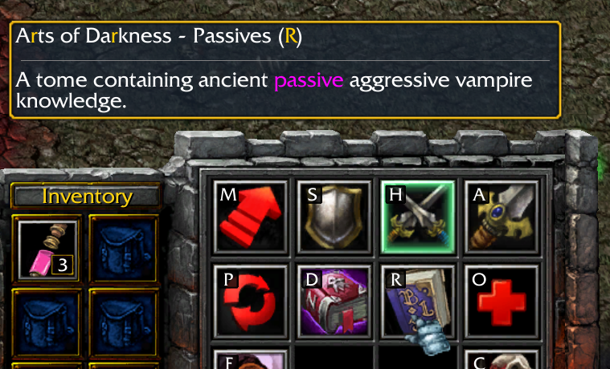 | 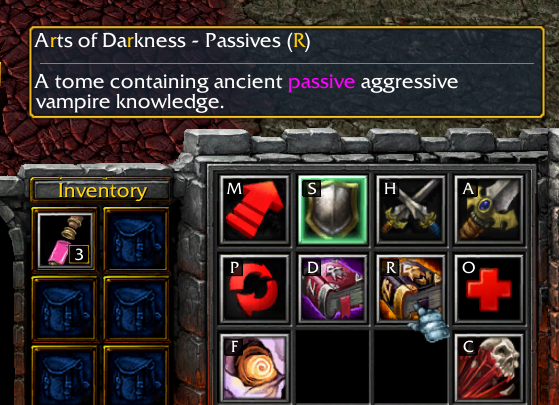 |
| 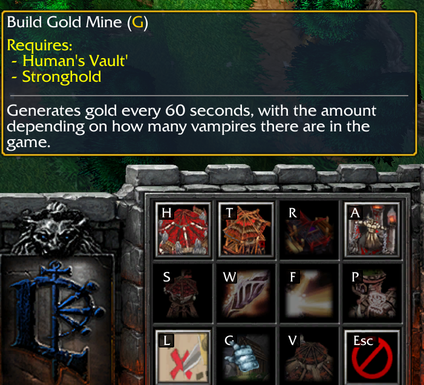 | 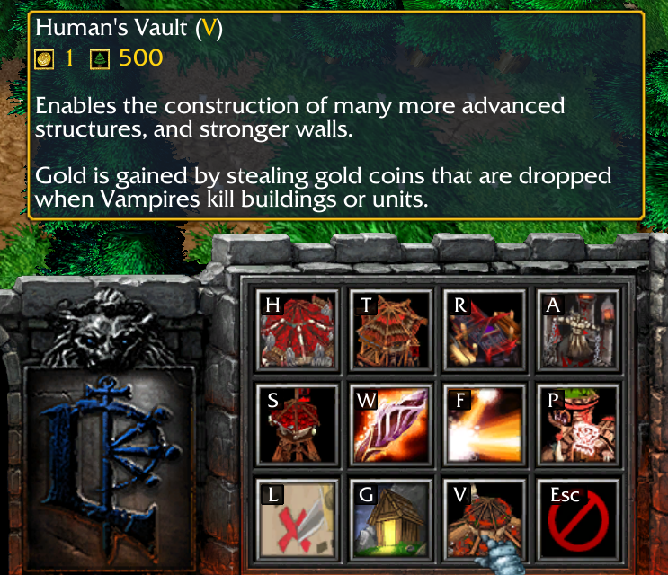 |
| 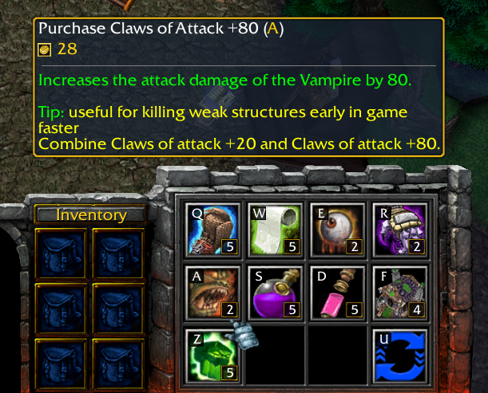 | 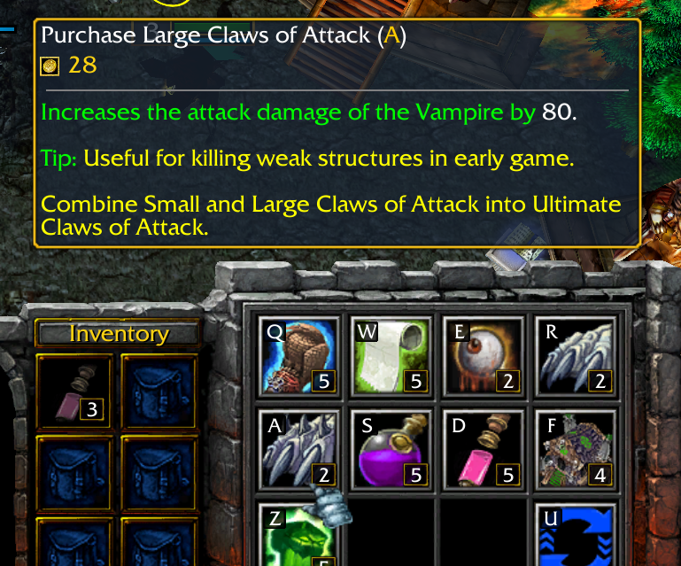 |
| 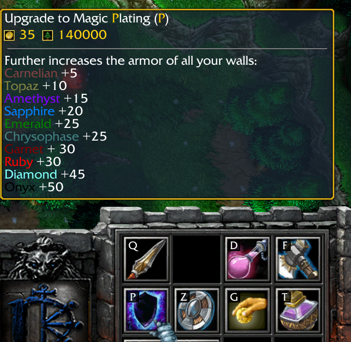 | 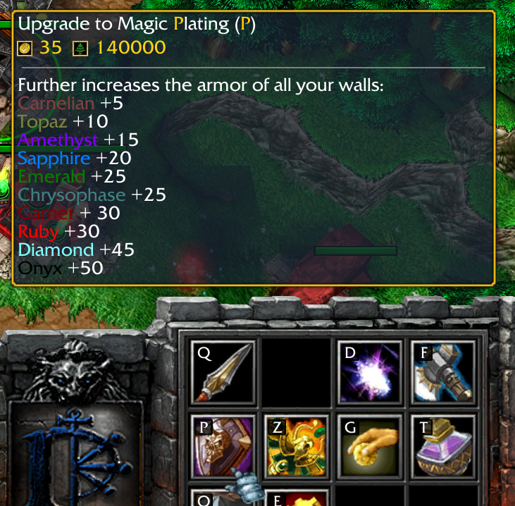 |
| 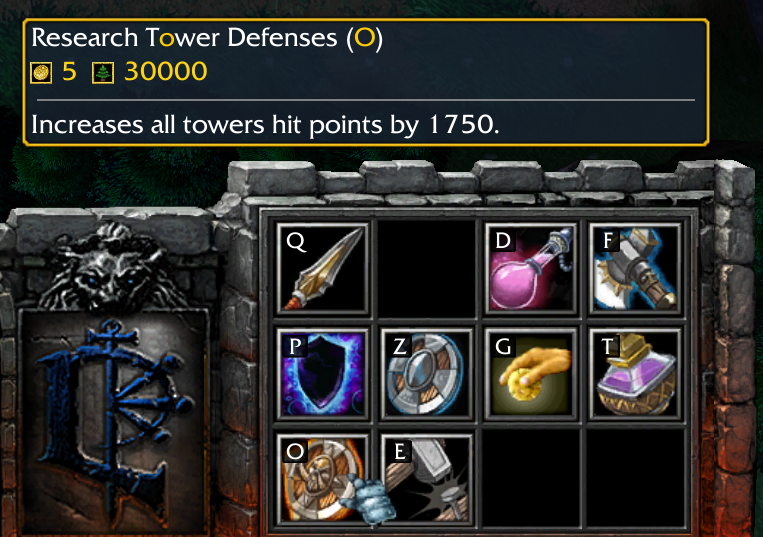 | 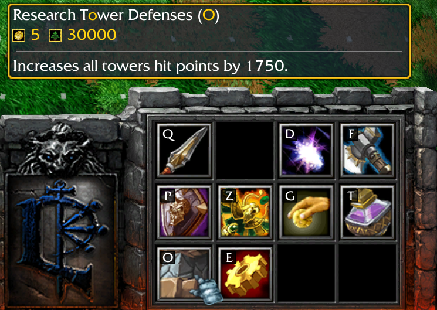 |
| 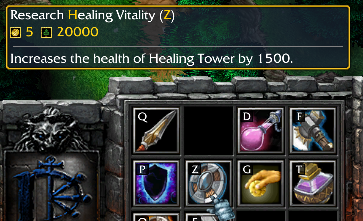 | 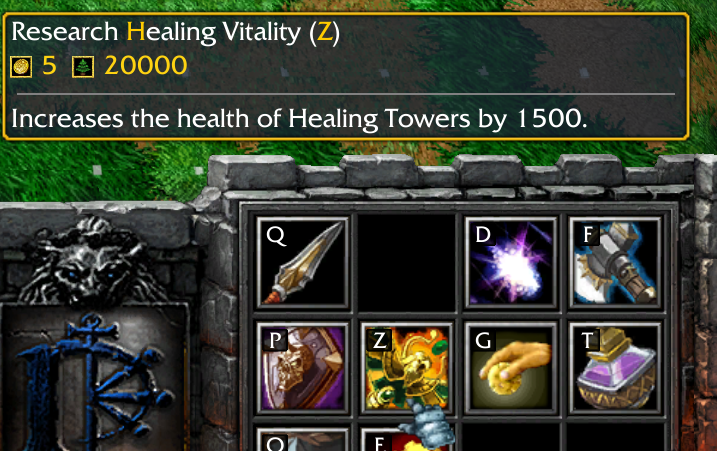 |
| 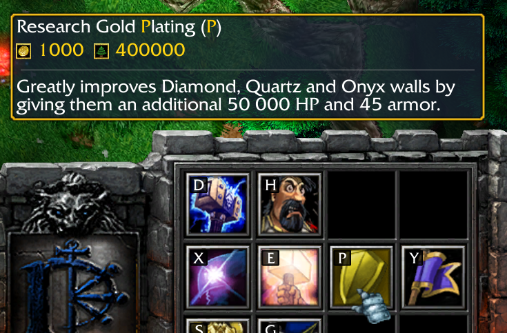 | 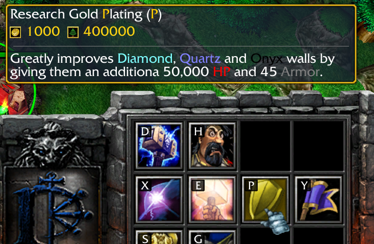 |
| 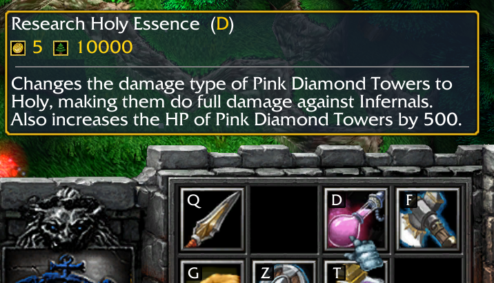 | 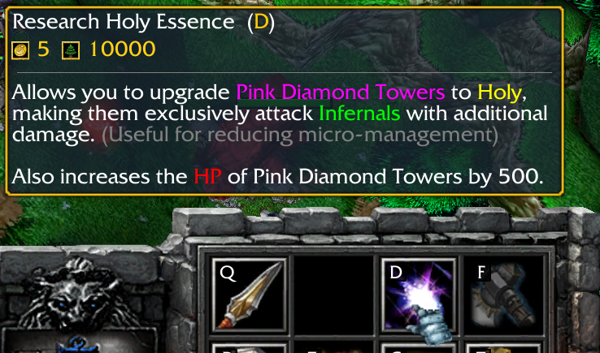 |
| 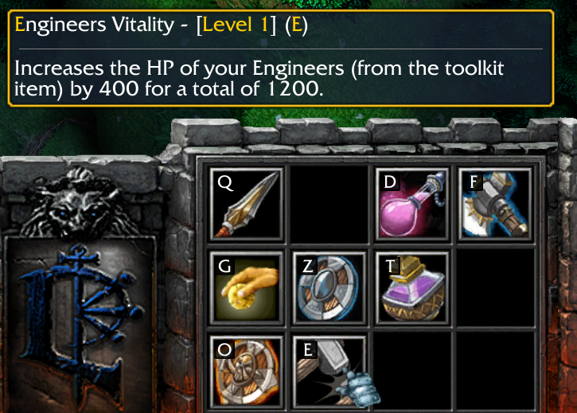 | 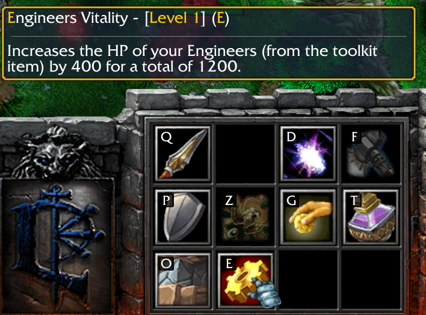 |
| 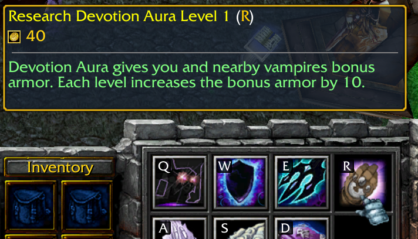 | 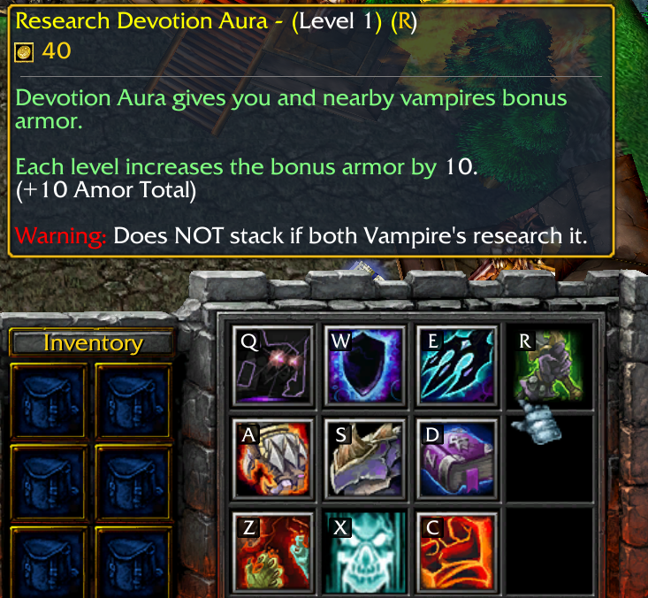 |
| 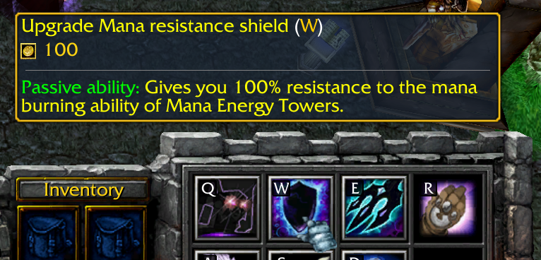 | 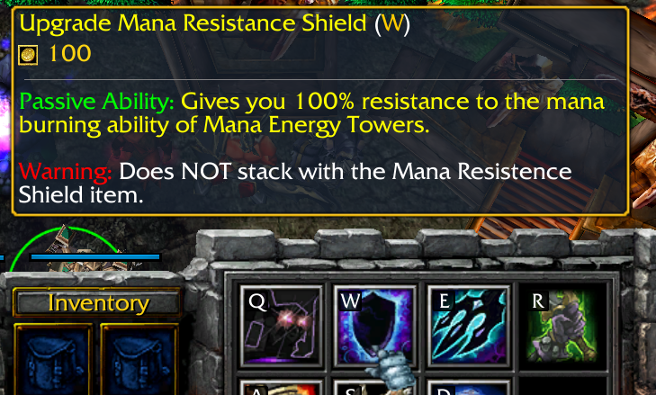 |
| 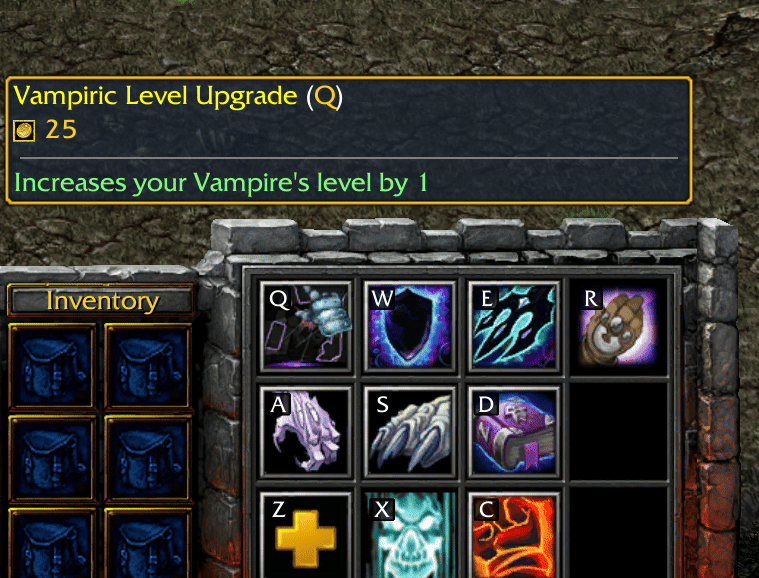 | 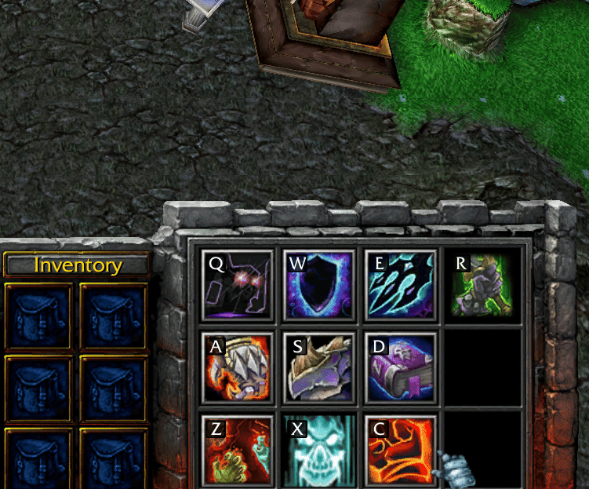 |

## Bases change

- Fixed a shifted tree base *19*
