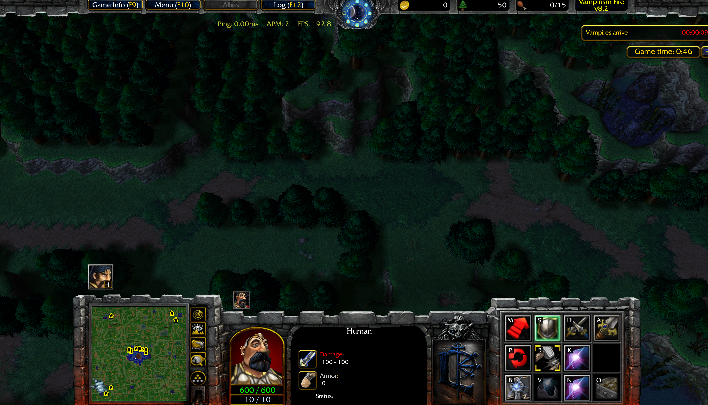
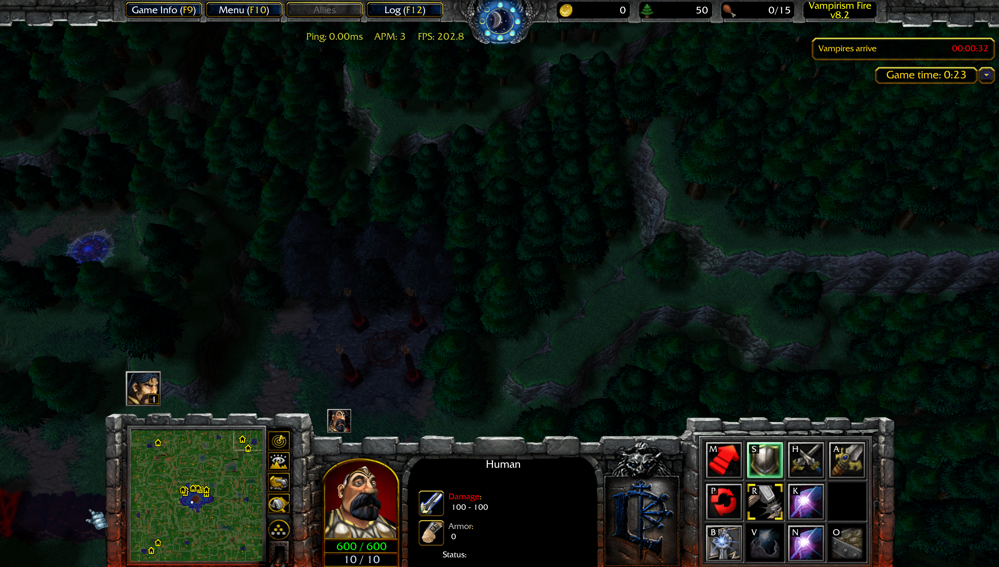
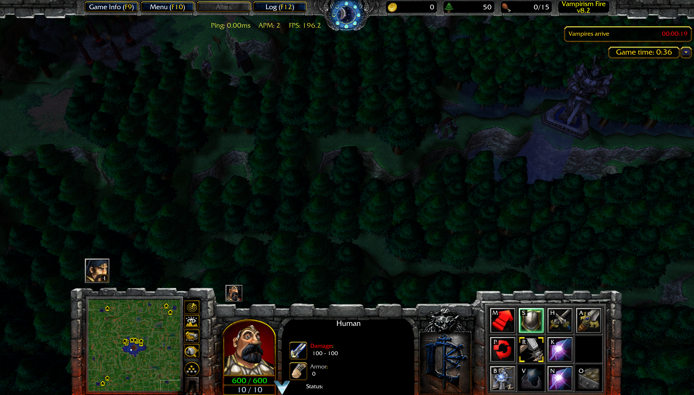

# Vampirism Fire 8.3

---

## Main

- ELO and games played have been reset for everyone.
- Disabled tracker spawning when a Slayer is inside a claimed allied base.
- Slayers now correctly display a death message when killed.
- Builders no longer have permanent vision in the vampire base.
  - Before
  
    
  
  - After
  
    

- Fixed an issue that would allow observers to vote in the custom mode.
- **Big Magic Potion**
  - Gold cost reduced from **9 → 5**.
  - Lumber cost reduced from **22 000 → 17 000**.
- Harvesters now have a sleep effect if they are not harvesting.

  

- **Race Selection**
  - Changed the placement of the race buttons.
  - Before:
  
    

  - After:
  
    

---

## Custom Mode

- Added **Vampire Mode** as a new custom mode option.

- New custom mode option: **No Edge Bases**
  - All edge bases are removed when the game starts.

  
  
  

### Solo Vamp Mode

- Updated income values:
  - Minutes 12–17: **60** gold/minute
  - Minutes 18–23: **100** gold/minute
  - Minutes 24–35: **200 → 150** gold/minute
  - Minutes 1–11 and minute 36 onward remain unchanged.

- Removed the 50% chain cooldown reduction.
- When a Vampire casts a chain, a second chain is cast on a random furb within 500 range of the Vampire.

---

## Human

- Critters now correctly award mana to the **Main Builder** when killed.
- **Holy Blood Tower** can now be paused using the flag.
- **Black Magic Spire** reworked and fixed.
  - Removed the minions' abilities.
  - Purge ability should now correctly purge the banish ability.

- **Bouncy Orb**
  - Level 1 now correctly requires Citadel of Faith.
  - Level 2 now correctly requires Command Center.
  - Level 2 gold cost increased from **0 → 10 gold**.
- **Temple of Prayers**
  - Fixed all pact rewards.
  - Fixed an issue that prevented pact effects from being applied to walls.
  - Fixed an issue that prevented pact effects from being removed when a pact expired.
  - Fixed the UI that shows pact durations for each player.

    

  - Hover:

    

---

## Orc

- Fixed an issue that required 2 gold mines instead of 1 to upgrade **Fortress**.
- Fixed an issue that would allow orcs to train 2 slayers.
- Fixed an issue that allowed Orcs to research Slayer Tech two extra times; it is now capped at level 3 like the other races.
- **Main Builder** mana regeneration increased from **0.100 → 0.200**.
- Wall tower tint changed to orange:
    
    

---

## Architect

- **Main Builder** mana regeneration increased from **0.100 → 0.200**.

- Re-added **The Casino**.
  - Added the **Casino Rules** ability tooltip.
  - Added **Gambling Dice**.
    - Requires 5 gold; 120-second cooldown.
    - 3/6 chance: Gain 7 gold (2 gold profit).
    - 2/6 chance: Gain nothing (lose 5 gold).
    - 1/6 chance: Unlock Alchemist Tower.

- **Alchemist Tower**
  - Gold cost: **15 gold**.
  - Lumber cost: **40 000 lumber**.
  - Stats:
    - Base HP: **20 000 HP**.
    - Armor: **25 armor**.
    - Base damage: **2500**.
    - Attack type: **Chaos Attack**.
    - Attack speed: **1.0**.
    - Active ability coming in the next patch: **Active Rage**.

- **Metal Amethyst Wall**
  - Tint changed:

    

- **Bounty Jade Wall**
  - Tooltip fixed.
  - Tints changed to a golden color:

    

- **Marble Wall** re-added.
  - Passive ability:
    - Gains **+25 armor** for each armor unit within **500 range** and **+10 armor** for each minion within **500 range**.
    - Repair time: **35**.
    - Base armor: **100**.
    - Gold cost: **45 gold**.
    - Lumber cost: **85 000**.
    - Base HP: **28 000**.

---

## Vampires

- **Slayers** now award **XP** to Vampires when killed.

- **Vampiric Recall**
  - Fixed an issue that set the vampire's **scaling value** to **1.0** instead of the model value.

- **Dracula Equipment**
  - Base damage decreased from **700 → 600**.

- **Ricochet Gem**
  - Structures hit by **Ricochet Gem** are now immune to additional Ricochet Gem damage for **20 seconds**.

- **Burst Gem**
  - Structures hit by **Burst Gem** are now immune to additional Burst Gem damage for **15 seconds**.

- **Tax System** adjustments
  - Tax cap increased:
    - **10 min:** 700 → 1000
    - **15 min:** 1300 → 1600
    - **20 min:** 1800 → 2400
    - **25 min:** 2500 → 3000

- **Altar of Blood**
  - Now owned by both **vampires**.
  - Fixed an issue where **Altar of Blood** required a "nearby patron" to buy minions.
  - Fixed an issue that provided vision in the middle of the map to builders.
  - Can now be selected using a button and assigned to a control group like the Research Center.

  
  
- Reverted the bounty gain from **Awakening**.

- **Vampires** can now use **TP Rod** on **Frenchies**.

- **Blood Particle — Level 2**
  - Cost increased from **7 → 10 lumber**.

- **Urn of Reveal**
  - Duration increased from **10 → 25 seconds**.

- **Unholy Infernal**
  - Now unlocks at the **16-minute** mark.

- Removed the unintended **Vampire Poison** upgrade from the **Vampiric Research Center**.

- Changed all vampire item-purchase and upgrade hotkeys to fit the QWERTY grid.

- **Silent Whisper**
  - Cooldown increased from **45 → 60 seconds**.
  - Mana cost increased from **600 → 800**.
  - Stock cooldown increased from **120 → 240 seconds**.
 
  - When holding 2 *Silent Whispers* in the vampire's inventory, they combine into an upgraded version:
    - Cooldown reduced from **60 → 30 seconds**.
    - Mana cost reduced from **800 → 0**.

- **Dark Spear**
  - Now regenerates **100 mana** for each unit killed.
  - Now regenerates **400 mana** for each slayer killed instead of **100**.

- **Nocturne's Edge** item removed.

- **Vampiric Awakening**
  - Gold awarded is now capped at **150** (previously unlimited).

- Level upgrades are locked if the vampire reaches level *23* before minute *15*.

- **Dracula's Cloak**
  - No longer requires **Cloak of Shadows**.
  - No longer requires **Recipe - Dracula Cloak**.

- **Cloak of Power**
  - Gold cost increased from **2400 → 2600**.
  - Damage gain reduced from **12 250 → 10 000**.

- **Awakening**
  - Fixed an issue that awarded more gold than intended.

- **Sphere of Doom**
  - Now correctly displays a red screen when purchased.
  - Reverted the music.

---

## QoL Changes

- Updated multiple icons and tooltips for clarity and consistency:
  - Replaced the static Slayer Tech hero icon with icons that change through the upgrade levels.
  - Replaced the Vampire Necromancy Book icon with the Advanced Necromancy Book icon.
  - Renamed **Orc's Vault** to **Human's Vault** so requirements consistently refer to the same building name.
  - Updated the Small, Large, and Ultimate Claws of Attack icons and descriptions, including their combination guide.
  - Replaced the reused **Magic Plating** icon with a distinct shield icon.
  - Updated the **Tower Defenses** upgrade icons so levels 1 and 2 use a consistent visual theme.
  - Replaced the Single **Healing Tower Vitality** icon with a clearer healing-tower upgrade icon.
  - Expanded the **Gold Plating** tooltip with wall-color references.
  - Updated the **Holy Essence** icon and description to better communicate its tower-upgrade purpose.
  - Replaced the reused **Engineer** repair icon with an engineering icon.
  - Updated the **Devotion Aura** icon and level descriptions, including armor-stacking behavior.
  - Added a warning that **Mana Resistance Shield** research does not stack with the item.
  - Updated several **Vampire Research Center** upgrade icons, descriptions, and colors.

### Visual Comparison

| Before | After |
| :---: | :---: |
|  |  |
|  |  |
|  |  |
|  |  |
|  |  |
|  |  |
|  |  |
|  |  |
|  |  |
|  |  |
|  |  |
|  |  |
|  |  |

---

## Base Changes

- Fixed a shifted tree in base *19*.
- Fixed a few shifted trees between base *9 and 10*.
- Added missing trees next to base *4*.
- Added missing trees top left of base *9*.
- Added a tree regrow spot top left of base *9*.