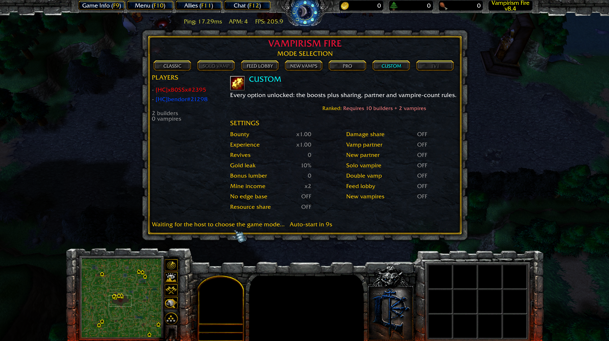

# Vampirism Fire 8.4

---

## Main

- Finish a **wall** will now display the message **"Wall finished!"**
- Leakrate setting can now be increased by 1 per click instead of 5.
- Improved the [loading-screen] fading effect.
- Improved the map load at map initialization.
- Fixed an issue where buying items from the **builder's neutral shop** would display message **"Only vampires can hire these units."**
- [Gold-mine] income removed from the Mode Selection.
- `-show` command UI design reworked.
    
    Before:

    

    After:

    

- Mode selection UI will now show the mode buttons for all players.

    Before:
    
    

    After:
    
    

## Main balance

- Builders will now gain **4g** at the min 4 instead of the min 5.
- [Workers] 
    - hatchet timer was reduced from min 3:30 to min 2:30.
    - The upgrade now lands for every builder at the same moment. It used to be staggered per
      player with compensation lumber, which is removed along with the stagger.
    - Wood gain was increased by **+50%**.

- [Command-Center] gold cost reduced from **400 -> 375**

- [Slayer] training time reduced from **60 -> 30** seconds.

- [Goblin-Tower-Builder]
    - Gold cost reduced from **150 -> 100**

- [Vampire-Spire] base damage increased **10 000 -> 11500**

## ELO system

- Ranked games now use the match result and both teams' average ELO to calculate rating changes. Winning gains ELO and losing costs ELO; the previous system could award ELO to a losing player.
- Human ELO changes also reflect how long each builder survived. Early deaths cost more, while builders who hold out for most of a lost game lose less. Builders who leave are rated for the time they played, and bitten builders are rated as human losses.
- Vampire partners receive the same ELO change. Winning faster gives both vampires a larger gain.
- Separate ELO ladders were added for standard 10v2, Solo Vampire, and 1v1 games, with distinct Human and Vampire ratings in each.
- The host can choose Ranked or Unranked when selecting a mode. A game only affects ELO if its mode's required lobby size is met at lock-in: 10 builders and 2 vampires for the shared ladder, 5 builders and 1 vampire for Solo Vampire, or 1 builder and 1 vampire for 1v1. Unranked games still count toward games played and wins.

## Human

- [Sacrificial-Tower] 
    - added to quell reach.
    - Level 1 build time decreased from **30 -> 10** seconds.
    - Level 2 build time decreased from **30 -> 15** seconds.

- [Human's-Vault] name fixed (was W by mistake).
- [Fang-Blade] gold cost reduced from **40 -> 34**.
- [Gold-Buy] ability is now available at the min **5 -> 4**
- [Base-Of-Operations] gold cost reduced from **1000 -> 600**.
- [Orange-Calcite-Outpost] now require **Citadel Of Faith**
- [Eclipse-Tower] | [Super-Eclipse-Tower] can now be **repaired**
- [Improved-Gem-Quality] removed the additional **HP** gain.
- [Healing-Tower] armor reduced from **75 -> 15**

## Architect

- [Gold-Buy] ability now available min **6 -> 5**
- [Base-Of-Operations] gold cost reduced from **1000 -> 800**
- [Orange-Aqua-Outpost] now require **Citadel Of Faith**
- [Improved-Gem-Quality] removed the additional **HP** gain.

## Orc

- [Gold-Buy] ability is now available min **6 -> 5**

## Vampires

- [Health-Beam] mana cost nerf
    - Level 1 : **100 -> 200**
    - Level 2 : **150 -> 325**
    - Level 3 : **300 -> 450**
    - Level 4 : **375 -> 550**
    - Level 5 : **775 -> 850**
    - level 6 : **950 -> 1200**
    - level 10 : **3400 -> 3800**

- [Blood-Particle] level 2 was removed.

- Tax system threshold decreased from **25 -> 24** min.

- **Vampires** now change direction without stopping. Warcraft units halt and rotate on the spot
  before moving when ordered more than 60 degrees off their facing, which made every reversal
  pay a stall; vampires now set off immediately on any heading and turn as they travel.

- **Vampires** spawn timer reduced from **55 -> 35** seconds.

- Mana resistance shield stock timer reduced from 7:05 min -> 6:00.

- [Demonic-Remains], [Sword-Of-Dracula] stock timer adjusted : 
    - 23 -> 24 -> 25 to 22 -> 23 -> 24 minutes.

- [Infernal]
    - Stock start delay reduced from **420 -> 300** seconds.

- [Burst-Gem] 
    - Stock start delay changed from **0 -> 12** minute.
    - Second burst gem allowed at the min 24.
    - Burst gem gold cost reduced from **240 -> 175** gold.

- [Ricochet-Gem]
    - Stock start delay changed from 15 -> 24 minute.
    - Second Ricochet Gem allowed at the min 36.

- [Dracula's-Cloak] 
    - Now require the recipe **Recipe - Dracula's Cloak** again and it's gold cost was increased from **175 -> 500** gold.
    - [Gauntlets-Of-The-Underworld]
        - Gold cost reduced from **2000 -> 1500**
    - The combined item **Dracula's Cloak** damage was reduced from **10500 -> 8500**
    - Now has scaling damage of **+500** damage per min starting from the min 36 until the min 60, capped at **+12000**.

- [Gauntlet-Of-Renfield]
    - Stock timer increased from **54 -> 55** min.
    - Attack speed gain increased from **30% -> 50%**.

- [Sphere-Of-Doom]
    - Gold cost reduced from **700 -> 650**

- [Income-Changes] : 
    - *24* min income timer changed to *23* minute
    - *36* min income timer changed to *35* minute.

- [Assassin] | [Meat-Carrier] | [Grave-Robber]
    - Stock starting time reduced from **12 -> 10** min.

- [Frozen-Infernal] | [Corrupted-Infernal]
    - Now available at the min **24 -> 23**.

- [Infernal-Meteor]
    - Now available at the min **15 -> 14**.

- New item : [Stanimir-Remains] (idea stolen from v7)
    - Same unlock timers as [Sword-Of-Dracula] or [Demonic-Remains].
    - 22 min gold cost **1050g**, 23 min gold cost **950g** and 24 min gold cost **850g**.
    - Gives +4000 damage, no other stats.
    - 2 **Stanimir Remains** can be combined together like **Vladimir Remains**.

- New item [Silent-Sphere-Of-Doom]
    - Gold cost **850g**
    - Does not warn when bought.

- New item [Gauntlet-Of-Damnation]
    - Combine with **Gauntlet of Hellfire**
    - Gold cost : **2000** gold.
    - Passive ability : Stack +100 damage per hit when attacking a wall. Effect lost after 4 seconds without attacking a wall.
    - Available at the min 42.

- New item [Nosferatu's-Mantle]
    - Sold at the **Demonic Gate**, combines with **Sword of Dracula** (which is consumed).
    - **+1250 STR**
    - **+1250 AGI**
    - **+1250 INT**
    - Passive ability : Stack **+25** damage per hit when attacking a wall. Effect lost after 4 seconds without attacking a wall.
    - Unlike [Gauntlets-Of-Hellfire] the stack does not double when a second Vampire is nearby, and does not gain the Pro mode bonus.
    - Gold cost **2000** gold, **2850** once combined.
    - Available at the min **34**.

- New item [Nocturnes-Edge]
    - **+250 STR**
    - **+250 AGI**
    - **+1000 INT**
    - **7500 Damage base**
    - Gold cost 2000gold
    - Available at the min **34**.
    - Can be combined with **Stanimir Remains** to make an upgraded version with **11500 base damage**.

## other stuff
- Fixed tooltips : Punisher, dracula equipment, Gauntlet of Renfield, Silent-Whisper, Dracula's Cloak (it advertised +10500 damage against the +8500 it grants).
- [Vladimir's-Remains] and [Stanimir's-Combined-Remains] now only need **one** free inventory slot to separate. They asked for two, which meant three slots counting the one the combined item sat in.
